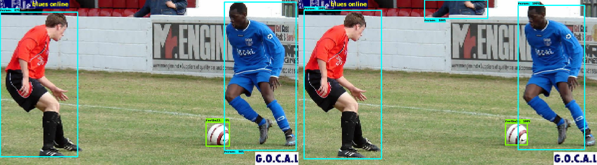

 # Football play detection
 ### Taeho KIM, Kyung Hee UNIV. <a href="https://github.com/HwangToeMat">GitHub Link</a>
 ## Data Download
 **EasyDownloader [<a href="https://github.com/HwangToeMat/Open-Images_EasyDownload">GitHub Link</a>]**

Download images that have both 'football category' and 'personal category' in each image with the code below.
```
python ../0.Open-Images_EasyDownload/EasyDownloader.py 
    --category "Football" 
    --category "Person" 
    --type "inter
```
**tf_record**

Create tf_record file with Football_label_map.pbtxt and create_Football_tf_record.py
**label_map**
```
item {
  name: "/m/01226z"
  id: 1
  display_name: "Football"
}
item {
  name: "/m/01g317"
  id: 2
  display_name: "Person"
}
```
**usage**
```
python create_Football_tf_record.py
    --data_dir=../0.Open-Images_EasyDownload/train_data/images
    --output_dir=./Football_tf_record
    --label_map_path=./Football_label_map.pbtxt
```
## Train
### model
| Model name        | Speed (ms)          | COCO mAP|
| ------------- |:-------------:| -----:|
| mask_rcnn_resnet101_atrous_coco      | 470      | 33 |
| faster_rcnn_resnet101_coco      | 106      | 32 |
| ssd_mobilenet_v2_coco      | 31      | 22 |
| **ssdlite_mobilenet_v2_coco**      | **27**      | **22** |

We used **ssdlite_mobilenet_v2_coco[<a href="http://download.tensorflow.org/models/object_detection/ssdlite_mobilenet_v2_coco_2018_05_09.tar.gz">Download Link</a>]** to analyze soccer games in real time because we *need fast computing speed.*

## Result
### graph
**DetectionBoxes_Precision**

**DetectionBoxes_Recall**

### Image(Left : our model / Right : ground truth )




## conclusion
**As you can see in the image of the result, GT recognizes people as one, but in our model, we see one by one.**
